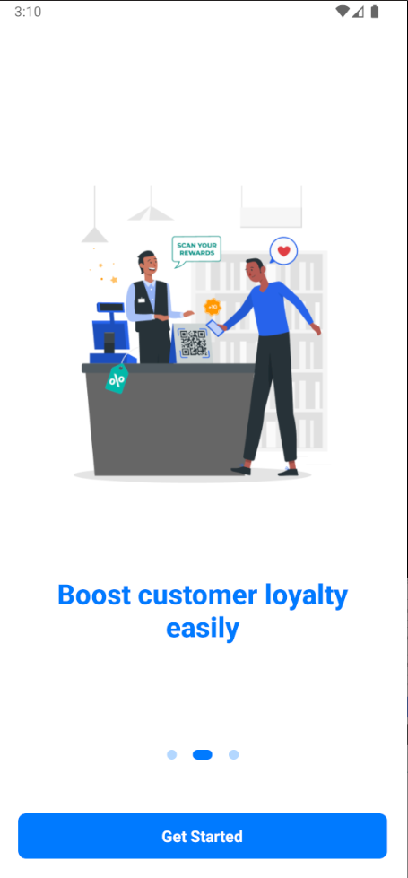
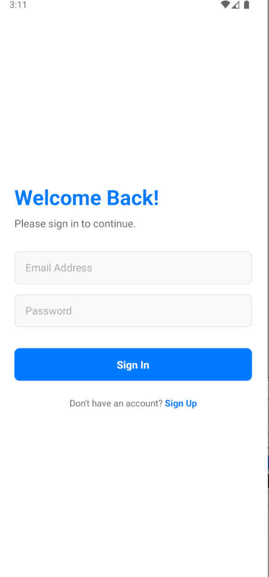
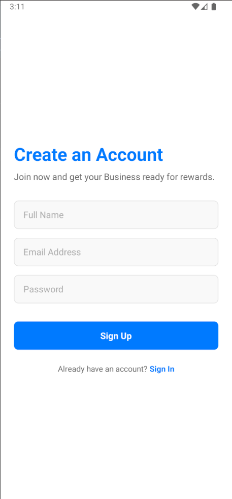
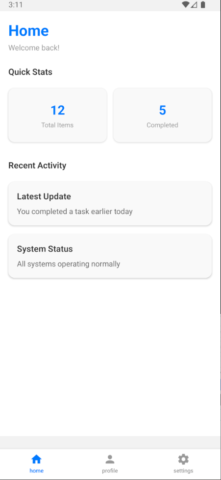
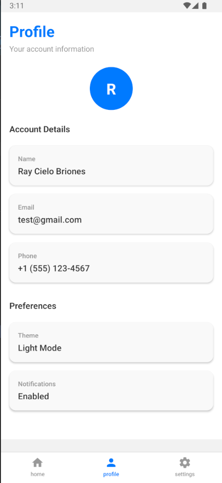
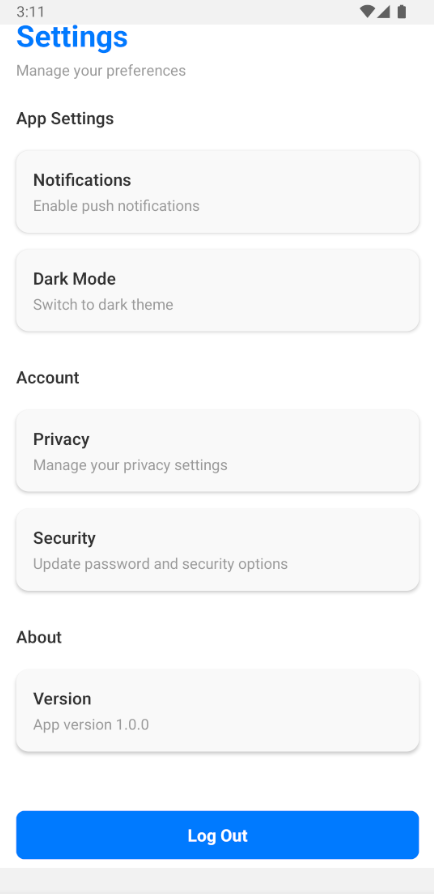
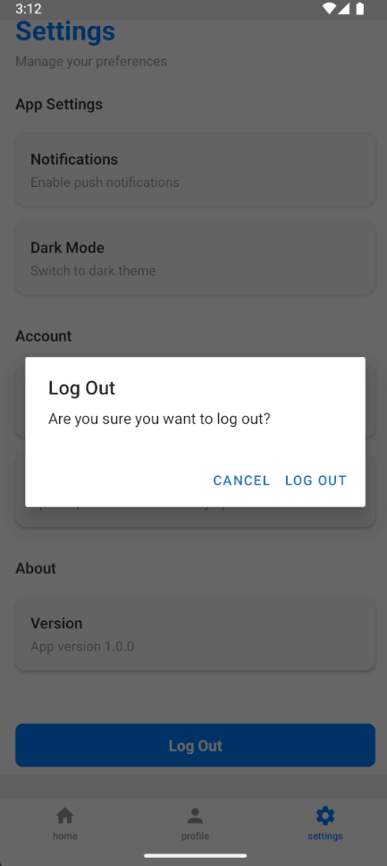

# Prixu Lite

A modern mobile application built with React Native and Expo, featuring user authentication, tab-based navigation, and a clean component-based architecture. This project demonstrates best practices in mobile development with secure session management and API integration.

## 📁 Project Structure

```
Prixu-Lite/
├── docker-be/                  # Backend Docker setup
│   ├── backend/                # Node.js TypeScript API
│   │   ├── src/
│   │   │   ├── app.ts         # Express app setup
│   │   │   ├── server.ts      # Server entry point
│   │   │   ├── api/
│   │   │   │   └── auth/      # Authentication endpoints
│   │   │   ├── middleware/    # Custom middleware
│   │   │   └── utils/         # Helper utilities
│   │   ├── Dockerfile
│   │   └── package.json
│   └── docker-compose.yml
└── rn-app/                     # React Native Expo app
    ├── app/                    # Navigation and screens
    │   ├── index.tsx          # Auth screens
    │   ├── signin.tsx
    │   ├── signup.tsx
    │   └── (app)/
    │       └── (tabs)/        # Main app tabs
    │           ├── home.tsx
    │           ├── profile.tsx
    │           └── settings.tsx
    ├── components/            # Reusable UI components
    │   ├── ui/               # Base components
    │   │   ├── button.tsx
    │   │   ├── card.tsx
    │   │   ├── header.tsx
    │   │   └── section.tsx
    │   └── screens/          # Screen components
    │       ├── homeScreen.tsx
    │       ├── profileScreen.tsx
    │       └── settingsScreen.tsx
    ├── context/              # React Context
    │   └── authContext.tsx   # Authentication state management
    ├── utils/                # Utilities
    │   └── apiCall/         # API integration
    │       ├── api.signin.ts
    │       ├── api.signup.ts
    │       └── api.logout.tsx
    ├── data/                 # Data utilities
    │   └── userData.tsx      # User data retrieval
    ├── validators/           # Input validation
    │   └── authValidator.ts
    ├── styles/               # Global styles
    ├── constants/            # App constants
    └── package.json
```

## 🚀 Getting Started

### Prerequisites

- Node.js (v16 or higher)
- npm or yarn
- Expo CLI (`npm install -g expo-cli`)
- Docker & Docker Compose (for backend)

### Mobile App Setup

```bash
cd rn-app
npm install
npx expo start
```

Then scan the QR code with Expo Go app (iOS/Android) or press 'i' for iOS simulator or 'a' for Android emulator.

### Backend Setup

```bash
cd docker-be
docker-compose up --build
```

The backend API will be available at `http://localhost:3000` (or your configured port).

## ✨ Key Features

### Authentication

- **Sign In** - Secure login with email and password validation
- **Sign Up** - User registration with form validation
- **Session Management** - Persistent sessions using Expo Secure Store
- **Logout** - Secure session termination with confirmation dialog

### Navigation

- **Tab-Based Navigation** - Easy switching between Home, Profile, and Settings
- **Safe Area Context** - Proper handling of notches and safe areas
- **Route-Based Architecture** - Powered by Expo Router for intuitive navigation

### Screens

**Home Screen**

- Quick stats display (Total items, Completed count)
- Recent activity feed
- Dynamic content updates

**Profile Screen**

- User avatar with initials
- Account details display (Name, Email, Phone)
- User preferences section
- Fetches real user data from secure storage

### Settings Screen

- App preferences (Notifications, Dark Mode)
- Account management options
- Security settings
- Logout functionality with confirmation

## 📸 Screenshots

### Authentication & Onboarding

<div style="display: flex; gap: 10px; flex-wrap: wrap;">
  
  
  
  
  
  
</div>

### Main App Screens

<div style="display: flex; gap: 10px; flex-wrap: wrap;">
  
  
  
  
</div>

## 🔐 Security Features

- **Secure Storage** - Uses Expo Secure Store for sensitive data
- **Session Persistence** - Automatic session recovery on app restart
- **Input Validation** - Form validation before submission
- **Protected Routes** - Authentication-based navigation

## 🎨 UI/UX Design

### Design System

- **Primary Color** - Blue (#007AFF) for actions and highlights
- **Typography** - Clear, readable font hierarchy
- **Spacing** - Consistent padding and margins throughout
- **Components** - Reusable, modular component architecture

### Component Library

- **Card** - Container component with shadow and rounded corners
- **Header** - Screen title and subtitle display
- **Section** - Content grouping with titles
- **Button** - Primary action button with styling
- **Input Fields** - Form inputs with validation feedback

## 🔌 API Integration

### Authentication Endpoints

- `POST /api/auth/signin` - User login
- `POST /api/auth/signup` - User registration
- `POST /api/auth/logout` - Session termination

### Request/Response Format

- JSON-based API communication
- Error handling with descriptive messages
- Token-based authentication (JWT recommended)

## 📦 Dependencies

### Mobile App (rn-app)

- **react-native** - Cross-platform mobile framework
- **expo** - Managed React Native platform
- **expo-router** - File-based routing
- **expo-secure-store** - Secure credential storage
- **react-native-safe-area-context** - Safe area management

### Backend (docker-be)

- **express** - Web framework
- **typescript** - Type safety
- **jsonwebtoken** - JWT authentication
- **dotenv** - Environment configuration

## 🛠️ Development Workflow

### Running in Development

1. Start backend: `docker-compose up --build`
2. Start mobile app: `npm start` in rn-app directory
3. Scan QR code with Expo Go or use emulator

### Building for Production

- **iOS**: `eas build --platform ios`
- **Android**: `eas build --platform android`
- **Backend**: Build Docker image: `docker build -t prixu-be .`

## 🔄 State Management

- **AuthContext** - Global authentication state
- **useState** - Local component state
- **useEffect** - Side effects and data fetching

## 📱 Supported Platforms

- iOS 12+
- Android 5+
- Web (via Expo Web)

## 🐛 Troubleshooting

### userData is null

- Ensure user is properly authenticated before accessing profile
- Check that Secure Store is properly initialized
- Verify API response includes user data

### Build Errors

- Clear cache: `npm cache clean --force`
- Reinstall dependencies: `rm -rf node_modules && npm install`
- Restart Expo: `npx expo start --clear`

### Docker Issues

- Ensure Docker daemon is running
- Check port 3000 is not in use
- Review docker logs: `docker-compose logs`

## 📝 Environment Variables

Create `.env` file in `rn-app/` and `docker-be/backend/`:

```
# Mobile App
EXPO_PUBLIC_API_URL=http://localhost:3000

# Backend
PORT=3000
NODE_ENV=development
```

## 🚀 Deployment

### Mobile

- Use EAS Build and Submit for app store releases
- Manage app versions in `app.json`

### Backend

- Deploy Docker container to cloud provider (AWS, Azure, GCP)
- Set production environment variables
- Configure CORS for production domain

## 📄 License

This project is private and for personal use.

## 👤 Author

Ray Cielo Briones

## 📞 Support

For issues or questions, refer to the project's issue tracker or contact the author.
